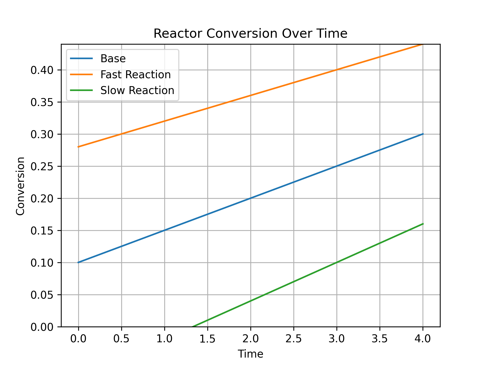
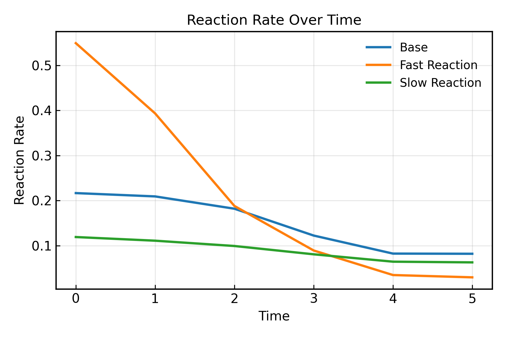
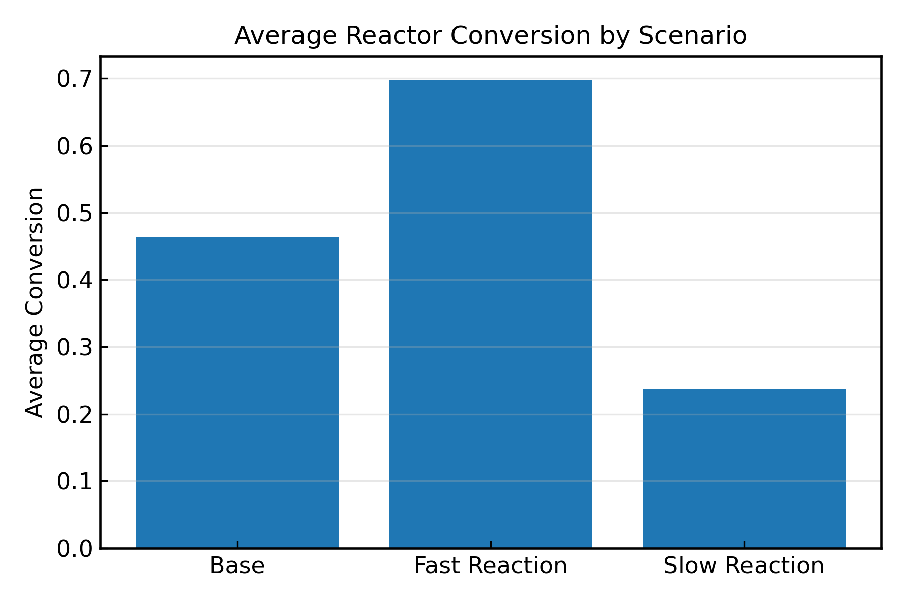

# Reactor Performance Analyzer


<p align="center">
  
</p>

<p align="center">
Conversion profiles for multiple reactor operating scenarios.
</p>

A Python tool for analyzing and comparing chemical reactor performance using synthetic kinetic datasets, numerical reaction rate estimation, and engineering visualization.

This project simulates multiple reactor operating scenarios, computes reactor performance metrics, visualizes reactor behavior, and exports analysis summaries for comparative evaluation.

The project combines chemical reaction engineering principles with numerical computing techniques for reactor performance analysis.

---

# Features

The Reactor Performance Analyzer can:

- Generate realistic synthetic reactor datasets
- Calculate reactant **conversion**
- Compute **reaction rates** using numerical differentiation
- Compare multiple reactor operating scenarios
- Rank reactor scenarios by average conversion
- Calculate percent performance improvement between scenarios
- Generate **engineering plots for reactor analysis**
- Export reactor performance summaries to CSV

---

# Engineering Concepts Used

This project implements several fundamental reaction engineering and numerical analysis concepts.

### Conversion

X = (CA_in − CA_out) / CA_in

### Reaction Rate Estimation

rA = −dCA/dt

Reaction rates are estimated numerically using finite-difference methods with NumPy gradient calculations.

### Comparative Reactor Analysis

The analyzer compares multiple reactor operating conditions including:

- baseline reactor behavior
- faster reaction kinetics
- slower reaction kinetics

These analyses help evaluate reactor performance under different operating conditions.

---

# Example Input Data

The analyzer accepts reactor concentration data generated from synthetic kinetic models.

Example dataset:

Time | CA_out_base | CA_out_fast | CA_out_slow
-----|-------------|-------------|-------------
0 | 0.97 | 1.01 | 1.01
1 | 0.76 | 0.46 | 0.89
2 | 0.56 | 0.22 | 0.79
3 | 0.39 | 0.08 | 0.69
4 | 0.31 | 0.04 | 0.63

This data can represent:

- simulated reactor experiments
- comparative kinetic studies
- synthetic process data for reactor analysis

---

# Example Output

Example results generated by the analyzer:

- Average Conversion (Base): 0.464
- Average Conversion (Fast Reaction): 0.698
- Average Conversion (Slow Reaction): 0.237
- Fast Reaction Improvement vs Base: +50.5%

Scenario Ranking:
1. Fast Reaction
2. Base
3. Slow Reaction

---

# Generated Plots

The analyzer generates several plots used in reactor performance analysis:

- Conversion vs Time
- Reaction Rate vs Time
- Average Conversion by Scenario

These plots help engineers compare reactor behavior and evaluate reaction performance under different operating conditions.

### Reaction Rate Plot

<p align="center">
  
</p>

<p align="center">
Reaction rate over time for multiple reactor operating scenarios.
</p>

### Average Conversion Comparison

<p align="center">
  
</p>

<p align="center">
Comparison between average conversions of multiple reactor operating scenarios.
</p>

---

# Example Workflow

1. Generate or load reactor concentration data
2. Calculate reactant conversion
3. Estimate reaction rates from concentration data
4. Compare reactor operating scenarios
5. Generate reactor performance plots
6. Export performance summaries to CSV

---

# Installation

### Clone the repository:

```
git clone https://github.com/MatthewNguyen865/reactor-performance-analyzer.git
```

### Install required packages:

```
pip install -r requirements.txt
```

### Run the program:

```
python main.py
```

---

# Project Structure

```
reactor-performance-analyzer/
|
|--- core/                    # analysis and computation modules
|    |--- comparisons.py
|    |--- data_extractor.py
|    |--- metrics.py
|    |--- statistics.py
|
|--- example_plots/           # exported engineering plots
|    |--- average_conversion_comparison.png
|    |--- conversion_plot.png
|    |--- reaction_rate_plot.png
|
|--- output/                  # exported analysis summaries
|    |--- reactor_summary.csv
|
|--- config.py
|--- data.csv
|--- data_generator.py
|--- main.py
|--- plotting.py
|--- README.md
|--- requirements.txt
```

---

# Project Goals

The goal of this project is to practice:

- chemical reaction engineering concepts
- numerical data analysis
- scientific programming in Python
- engineering data visualization
- modular software design
- engineering analytics workflows

---

# Future Improvements

Planned improvements include:

- support for multiple experimental datasets
- regression-based kinetic parameter estimation
- automated engineering report generation
- support for additional reactor models

---

# Technologies Used

- Python
- NumPy
- Pandas
- Matplotlib

---

# Author

Matthew Nguyen  
Chemical Engineering Student  
Texas A&M University